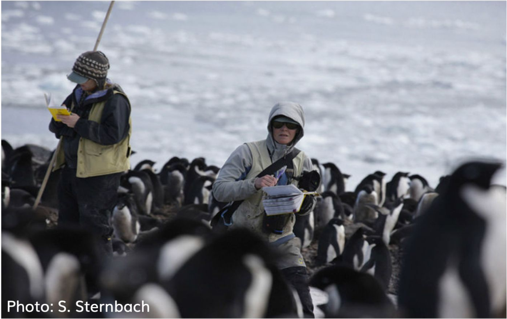

今天讲一个关于企鹅的数据故事。

```{r out.width = '100%', echo = FALSE}

```


# 导入数据

```{r message = FALSE, warning = FALSE}
library(tidyverse)

penguins <- read_csv("./demo_data/penguins.csv") 
penguins
```


## 变量含义

|variable          |class   |description |
|:-----------------|:-------|:-----------|
|species           |integer | 企鹅种类 (Adelie, Gentoo, Chinstrap) |
|island            |integer | 所在岛屿 (Biscoe, Dream, Torgersen) |
|bill_length_mm    |double  | 嘴峰长度 (单位毫米) |
|bill_depth_mm     |double  | 嘴峰深度 (单位毫米)|
|flipper_length_mm |integer | 鰭肢长度 (单位毫米) |
|body_mass_g       |integer | 体重 (单位克) |
|sex               |integer | 性别 |
|year              |integer | 记录年份 |


```{r out.width = '86%', echo = FALSE}
knitr::include_graphics("images/culmen_depth.png")
```


# 探索性分析

探索以下问题：

- 每种类型企鹅有多少只？
- 男企鹅的身材比女企鹅好？
- 男企鹅的嘴巴比女企鹅的长？
- 不同岛屿的企鹅嘴峰深度不同？
- 不同种类的宝宝，体重均值是否不同？
- ...


## 选择"bill_"开始的列

```{r}
penguins %>% select(starts_with("bill_"))
```


## 选择"_mm"结尾的列

```{r}
penguins %>% select(ends_with("_mm"))
```


## 选择含有"length"的列
```{r}
penguins %>% select(contains("length"))
```


## 选择数值型的列

```{r}
penguins %>% select(where(is.numeric))
```


## 选择字符串类型的列

```{r}
penguins %>% select(where(is.character))
```


## 选择字符串类型以外的列

```{r}
penguins %>% select(!where(is.character))
```

## 可以用多种组合来选择

```{r}
penguins %>% select(species, starts_with("bill_"))
```


## 寻找男企鹅

函数 `filter()` 中的逻辑运算符

Operator  | Meaning
----------|--------
`==`      | Equal to
`>`       | Greater than
`<`       | Less than
`>=`      | Greater than or equal to
`<=`      | Less than or equal to
`!=`      | Not equal to
`%in%`    | in 
`is.na`   | is a missing value (NA)
`!is.na`  | is not a missing value
`&`       | and
`|`       | or


```{r}
penguins %>% filter(sex == "male")
```

```{r}
penguins %>% filter(species %in% c("Adelie", "Gentoo"))
```


```{r}
penguins %>%
  filter(species == "Adelie" &  bill_length_mm > 40 )
```


## 弱水三千，只取一瓢
```{r}
penguins %>% 
  slice(1)
```


```{r}
penguins %>% 
  group_by(species) %>% 
  slice(1)
```


```{r}
penguins %>% 
  arrange(-bill_length_mm) %>% 
  slice(1)

penguins %>% 
  slice_max(bill_length_mm)
```

## 寻找企鹅中的胖子

```{r}
penguins %>% 
  mutate(
    body = if_else(body_mass_g > 4200, "you are fat", "you are fine")
)
```

**随堂练习**：用考试成绩的均值代替缺失值

```{r}
df <- tibble::tribble(
    ~name,     ~type, ~score,
  "Alice", "english",    80,
  "Alice",    "math",    NA,
    "Bob", "english",    70,
    "Bob",    "math",    69,
  "Carol", "english",    NA,
  "Carol",    "math",    90
  )
df
```

## 给企鹅身材分类

```{r}
penguins %>% mutate(
  body = case_when(
    body_mass_g < 3500                       ~ "best",
    body_mass_g >= 3500 & body_mass_g < 4500 ~ "good",
    body_mass_g >= 4500 & body_mass_g < 5500 ~ "general",
    TRUE                                     ~ "other"
  )
)
```


**随堂练习**：按嘴峰长度分成A, B, C, D 4个等级


## 每种类型企鹅有多少只？
知识点：`n()`函数

```{r}
penguins %>%
  summarise(
    n = n()
  ) 
```


```{r}
penguins %>%
  group_by(species) %>%
  summarise(
    n = n(),
  )
```


统计某个变量中**各组**出现的次数，可以使用`count()`函数

```{r}
penguins %>% count(species)
```


不同性别的企鹅各有多少
```{r}
penguins %>% count(sex, sort = TRUE)
```


可以在`count()`里构建新变量，并利用这个新变量完成统计。
比如，统计嘴巴长度大于40的企鹅个数

```{r}
penguins %>% count(longer_bill = bill_length_mm > 40)
```

## 强制转换

矢量中的元素必须是相同的类型，但如果不一样呢，会发生什么？
这个时候R会**强制转换**成相同的类型。这就涉及数据类型的转换层级

- character > numeric > logical
- double > integer

比如这里会强制转换成字符串类型
```{r}
c("foo", 1, TRUE)
```

这里会强制转换成数值型
```{r}
c(1, TRUE, FALSE)
```


**随堂练习**：补全下面代码，求嘴峰长度大于40mm的占比？


```{r}
penguins %>% 
  mutate(is_bigger40 = bill_length_mm > 40)
```


# across()之美

我们想知道，嘴巴深度和厚度的均值

```{r}
penguins %>%
  summarize(
    depth = mean(bill_depth_mm)
  )
```


```{r}
penguins %>%
  summarize(
    depth  = mean(bill_depth_mm),
    length = mean(bill_depth_mm)
  )
```

长度和厚度惊人的相等。我是不是发现新大陆了？


更安全、更简练的写法，王老师的最爱

```{r}
penguins %>%
  summarize(
     across(c(bill_depth_mm, bill_length_mm), mean)
 )
```


```{r, eval = FALSE}
across(.cols = everything(), .fns = NULL, ..., .names = NULL)
```

- `across()` 对**多列**执行相同的函数操作，返回**数据框**


## 数据中心化

```{r}
penguins %>%
  mutate(bill_length_mm = bill_length_mm - mean(bill_length_mm))
```


更清晰的办法

```{r}
centralized <- function(x) {
  x - mean(x)
}


penguins %>%
  mutate(
    across(bill_length_mm, centralized)
  )
```


```{r}
penguins %>%
  mutate(
    across(c(bill_length_mm, bill_depth_mm), centralized)
  )
```


## 数据标准化

```{r}
std <- function(x) {
  (x - mean(x, na.rm = TRUE)) / sd(x, na.rm = TRUE)
}

penguins %>%
  summarise(
    across(where(is.numeric), std)
  )


# using across() and purrr style
penguins %>%
  summarise(
    across(starts_with("bill_"), ~ (.x - mean(.x)) / sd(.x))
  )
```


## 多列多个统计函数

```{r}
penguins %>%
  group_by(species) %>%
  summarise(
    across(ends_with("_mm"), list(mean = mean, sd = sd), na.rm = TRUE)
  )
```


**随堂练习**：
- 以sex分组，对"bill_"开头的列，求出每列的最大值和最小值


# 下节课讲可视化

## 我图都画的这么骚了，你确定不来听课？

```{r}
penguins %>%
  select(species, bill_length_mm:body_mass_g) %>%
  pivot_longer(
    cols      = -species,
    names_to  = "measurement",
    values_to = "value"
  ) %>%
  ggplot(aes(x = value)) +
  geom_density(aes(color = species, fill = species), size = 1.2, alpha = 0.2) +
  facet_wrap(vars(measurement), ncol = 2, scales = "free")
```


```{r}
penguins %>%
  select(species, bill_length_mm:body_mass_g) %>%
  pivot_longer(
    cols      = -species,
    names_to  = "measurement",
    values_to = "value"
  ) %>%
  ggplot(aes(x = species, y = value)) +
  geom_boxplot(aes(color = species, fill = species), size = 1.2, alpha = 0.2) +
  facet_wrap(vars(measurement), ncol = 2, scales = "free")
```


```{r}
penguins %>%
  select(species, bill_length_mm:body_mass_g) %>%
  pivot_longer(
    cols      = -species,
    names_to  = "measurement",
    values_to = "value"
  ) %>%
  ggplot(aes(x = value, y = species, fill = species)) +
  ggridges::geom_density_ridges() +
  facet_wrap(vars(measurement), scales = "free")
```


