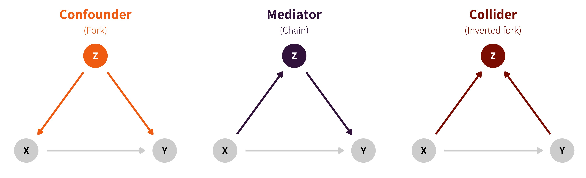

```{r, warning = F, message = F }
library(tidyverse)
library(dagitty)
library(ggdag)
```


# 因果推断的小案例

有一个市场调研团队，想去探究**提高市场营销支出对销售**的影响。假定我们手头上有这些数据

- `mkt`    市场营销支出
- `visits` 网站访问量
- `sales`  销售额
- `comp`   竞争指数


我们基于以下公式模拟了数据集，

$$
\begin{align}
\text{sales} &= \beta_1\text{vists} + \beta_2\text{comp }+ \epsilon_1 \\
\text{vists} &= \beta_3\text{mkt} + \epsilon_2\\
\text{mkt} &= \beta_4\text{comp} + \epsilon_3\\
\text{comp} &= \epsilon_4
\end{align}
$$

指定的系数分别是 $\{\beta_1, \beta_2, \beta_3\, \beta_4\} = \{0.3, -0.9, 0.5, 0.6\}$ 


模拟出来的数据大致是这个样子的

```{r define model and simulate data, results = "asis"}
g <- dagitty("dag {
sales [outcome, pos=\"0,0\"]
mkt [exposure, pos=\"2,0\"]
comp [pos=\"1,1\"]
visits [pos=\"1,0\"]
visits -> sales [beta = 0.3]
mkt -> visits [beta = 0.5]
comp -> mkt [beta = 0.6]
comp -> sales [beta = -0.9]
}")

sim_data <- simulateSEM(g, N = 10000) %>%
  mutate(
    sales = floor((sales - min(sales)) * 100), # make the numbers seem a bit more realistic
    mkt = (mkt - min(mkt)) * 100,
    comp = comp - min(comp),
    visits = floor((visits - min(visits)) * 1000)
  ) %>%
  select(mkt, visits, sales, comp)

head(sim_data)
```


现在，我们的目标就是预测营销支出对销售额的影响。答案是0.15，这个数怎么来的呢
$$
\beta_1 \cdot \beta_3 = 0.3 \cdot 0.5 = 0.15
$$

**如果用模型反演回去，得到0.15，就说明我们模型是正确的**


 
## 第一次尝试

先画出`mkt` 与 `sales`散点图

```{r plot scatter plot}
sim_data %>% 
  ggplot(aes(mkt, sales)) + 
  geom_point(alpha = 0.2) 
```

很遗憾，通过图形我们看到两者的关系是负相关，和我们的预期完全相反。

我们还是用线性模型拟合下

$$\text{sales} = r_0 + r_1\text{mkt} + \epsilon$$ 

会给出如下系数
 
```{r fit model1, results = "asis"}
model <- lm(sales ~ mkt, data = sim_data)
coef(model)
```


结果和我们的预期(0.15)相差很大。负数意味着，增加市场营销，会降低销售。

**说明**：关联不等于因果，甚至给出了与因果关联完全相反的结论


## 第二次尝试

第一次尝试，我们只用了一个预测变量。现在我们把所有的预测因子都用上，

多元线性回归模型
$$
\text{sales} = r_0 + r_1\text{mkt} + r_2\text{visits} + r_3\text{comp} + \epsilon
$$ 

我们得到系数

```{r fit model2, results = "asis"}
model <- lm(sales ~ mkt + visits + comp, data = sim_data)
coef(model)
```

这个结果显示，市场营销对销售几乎不起作用。


# 或许，我们应该考虑变量彼此之间的关联。

以上两次尝试都失败了，让我们感到困惑。向经济学领域的专家求助后，我们了解到：

在激烈的市场竞争环境下，企业通常会增加营销支出。那么，**竞争**有可能是一个"confounding" 因子:

- 竞争激烈，需要提升营销支出
- 竞争激烈，也会导致销售下降


```{r, out.width = '80%', echo = FALSE}

```


同时，市场营销会增加访问量，而这些访问量也会带来销售额的增加


将以上信息汇总成一张**有向无环图** Directed Acyclic Graph (DAG)

```{r, fig.width = 5, fig.asp = 0.6}
ggdag(tidy_dagitty(g)) + 
  theme_dag_blank()
```

因此，我们需要

- 把**comp**作为 confounding 因子加入回归模型，
- 模型中**visits**在某种程度上"blocks" or "absorbs"营销对销售的影响，因此我们应该将其从模型中删除。

最终得到模型

$$
\text{sales} = r_0 + r_1\text{mkt} + r_2\text{comp} + \epsilon
$$

回归系数如下

```{r fit model3, results = "asis"}
model <- lm(sales ~ mkt + comp, data = sim_data)
coef(model)
```

Yes! 我们得到了正确估计。


# Further reading

- <https://iyarlin.github.io/2019/02/08/correlation-is-not-causation-so-what-is/>
- <https://github.com/malcolmbarrett/ggdag>
- [Causal Inference in Statistics - A Primer](http://bayes.cs.ucla.edu/PRIMER/)
