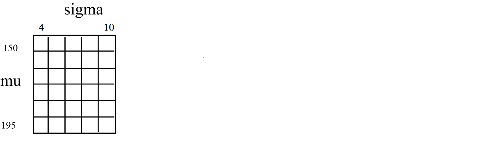
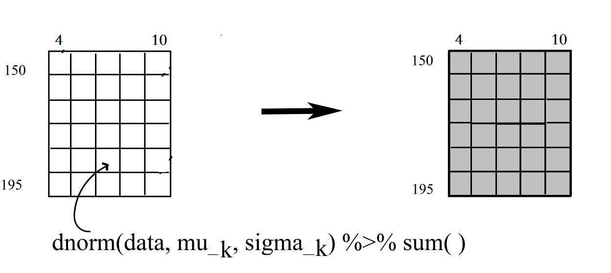
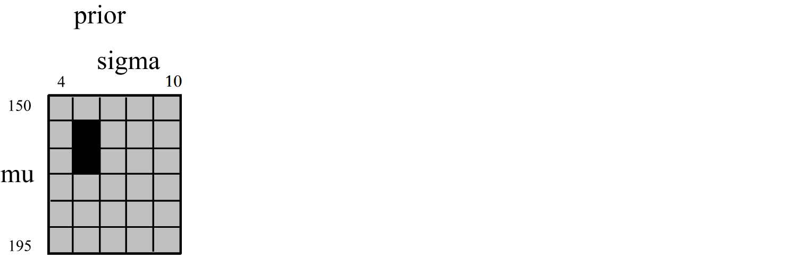
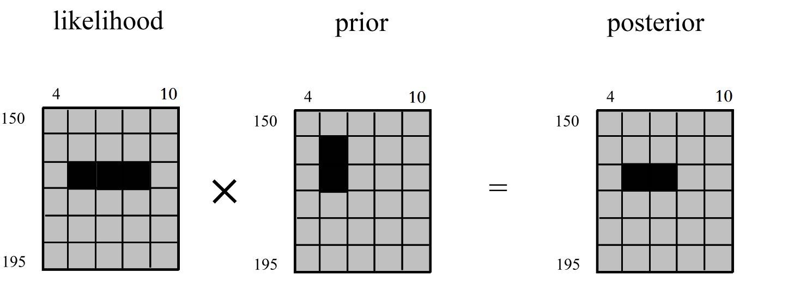
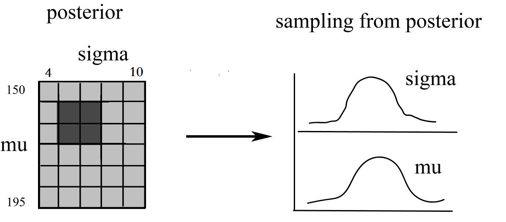

# 统计推断

> Statistical inference is the process of using observed data to infer properties of the statistical distributions that generated that data.


```{r echo=FALSE, out.width = '100%'}
knitr::include_graphics("images/inference.png")
```

简单点说

$$
\Pr(\text{parameters} | \text{data}).
$$


这个量实际上是贝叶斯定理中的后验概率分布(*posterior distribution*)

$$
\underbrace{\Pr(\text{parameters} | \text{data})}_{\text{posterior}} = \frac{\overbrace{\Pr(\text{data} | \text{parameters})}^{\text{likelihood}} \overbrace{\Pr(\text{parameters})}^{\text{prior}}}{\underbrace{\Pr(\text{data})}_{evidence}} .
$$

## 贝叶斯推断 

- 观察到样本数据后，如何推断总体分布的参数$\theta$？
  - 可以用贝叶斯后验概率$p(\theta \vert Y)$来回答

- 贝叶斯公式

$$
p(\theta \vert Y) = \frac{p(Y \vert \theta) p(\theta)}{p(Y)}
$$

- $p(Y \vert \theta)$ 是似然函数
  - 在给定参数后，数据出现的概率
- $p(\theta)$ 参数的先验概率
  - 在看到数据前，参数各种可能性的分布
- $p(Y)$ 边际似然
  - 忽略


$$
p(\theta \vert Y) \propto p(Y \vert \theta) p(\theta).
$$


这里把总体的似然函数，写成每个数据点的似然函数**连乘**的形式：
$$
p(\theta \vert Y) \propto p(\theta) \prod^N_{n=1} p(y_n \vert \theta)
$$


为了方便计算，我们两边取对数，连乘变成了连加。也就说，我们计算的log probabilities


$$
\text{log}\ p(\theta \vert Y) \propto \text{log}\ p(\theta) + \sum^N_{n=1} \text{log}\ p(y_n \vert \theta)
$$


下面，通过具体的案例演示简单的贝叶斯推断(Bayesian inference)


## 川师学生身高的分布？

我们想知道川师学生的平均身高是是多少？不大可能把所有学生召集到一起测量，所以我们随机的选取200位学生，测量了他们的身高

```{r, message=FALSE, warning=FALSE}
library(tidyverse)
d <- read_rds("./demo_data/height_weight.rds") %>% 
     select(sex, height)

head(d, 8)
```


用dplyr函数很容易得到样本的统计量

```{r}
d %>% 
  summarise(
    across(height, list(mean = mean, median = median, max = max, min = min, sd = sd))
)
```


```{r}
d %>% 
  ggplot(aes(x = height)) +
  geom_density()
```


## 推断

> 注意到，我们的数据只是样本，不代表全体分布。我们只有通过样本去**推断**全体分布情况。


通过前面的身高的统计量，我们可以合理的猜测：

- 均值可能是160，162，170，172，..., 或者说这个均值在一个范围之内，在这个范围内，有些值的可能性大，有些值可能性较低。比如，可以假定均值在168的可能最大，往两端的可能性逐渐降低。如果用数学语言来描述，可以假定身高均值服从某个正态分布。

- 方差可以假设在`(4, 10)`范围内都有可能，而且每个位置上的概率都相等。


把我们的猜测画出来就是这样的，

```{r, fig.width = 6, fig.height = 2.5}
library(patchwork)
p1 <- 
  tibble(x = seq(from = 100, to = 230, by = .1)) %>% 
  ggplot(aes(x = x, y = dnorm(x, mean = 168, sd = 20))) +
  geom_line() +
  xlab("height_mean") +
  ylab("density")


p2 <- 
  tibble(x = seq(from = 3, to = 11, by = .1)) %>% 
  ggplot(aes(x = x, y =  dunif(x, min  = 4, max = 10))) +
  geom_line() +
  xlab("height_sd") +
  ylab("density")

p1 + p2
```


下面，通过**贝叶斯方法**来验证我们的想法。具体步骤如下，

### 参数空间

我们这里构建 1000*1000个 (`mu, sigma`) 参数网格
```{r echo=FALSE, out.width = '100%'}

```

```{r}
d_grid <- crossing(
     mu = seq(from = 150, to = 195, length.out = 1000),
  sigma = seq(from = 4,   to =  10, length.out = 1000)
)

d_grid
```


###  似然(likelihood)

```{r echo=FALSE, out.width = '100%'}

```

参数空间里，计算在每个`(mu,sigma)`组合下，身高值(`d$height`)出现的概率密度`dnorm(d2$height, mean = mu, sd = sigma)`之和。


```{r, eval=FALSE}
dnorm(d$height, mean = 150, sd = 4, log = T) %>% sum()
dnorm(d$height, mean = 150, sd = 4.02, log = T) %>% sum()
dnorm(d$height, mean = 150, sd = 4.04, log = T) %>% sum()
```

很显然，不同的(mu, sigma)，概率密度之和是不一样的，我们这里有`1000*1000` 个(mu,sigma)组合，所以会产生 `1000*1000` 个值


```{r}
# 似然对数
grid_function <- function(mu, sigma) {
	dnorm(d$height, mean = mu, sd = sigma, log = T) %>% 
		sum()
}
```


```{r, eval=FALSE}
d_grid %>% 
	mutate(log_likelihood = map2_dbl(mu, sigma, grid_function)) 
```


### 先验概率(prior)


```{r echo=FALSE, out.width = '100%'}

```


```{r, eval=FALSE}
d_grid %>% 
	mutate(prior_mu     = dnorm(mu,    mean = 168, sd  = 20, log = T),
	       prior_sigma  = dunif(sigma, min  = 4,   max = 10, log = T)) 
```


### 后验概率(posterior)


```{r echo=FALSE, out.width = '100%'}

```


**注意**：先验、似然和后验，我们使用的是对数计算，因此乘法变为了加法，最后通过exp将对数变回概率


```{r}
d_grid <-
	d_grid %>%
	mutate(log_likelihood = map2_dbl(mu, sigma, grid_function)) %>%
	mutate(prior_mu       = dnorm(mu,    mean = 168, sd  = 20, log = T),
	       prior_sigma    = dunif(sigma, min  = 4,   max = 10, log = T)) %>%
	mutate(product        = log_likelihood + prior_mu + prior_sigma) %>%
	mutate(probability    = exp(product - max(product)))

head(d_grid)
```


```{r, fig.width = 3.25, fig.height = 3}
d_grid %>%
  ggplot(aes(x = mu, y = sigma, z = probability)) +
  geom_contour() +
  labs(
    x = expression(mu),
    y = expression(sigma)
  ) +
  coord_cartesian(
    xlim = range(d_grid$mu),
    ylim = range(d_grid$sigma)
  ) +
  theme(panel.grid = element_blank())
```


```{r, fig.width = 4.5, fig.height = 3}
d_grid %>%
  ggplot(aes(x = mu, y = sigma)) +
  geom_raster(
    aes(fill = probability),
    interpolate = T
  ) +
  scale_fill_viridis_c(option = "A") +
  labs(
    x = expression(mu),
    y = expression(sigma)
  ) +
  theme(panel.grid = element_blank())
```


### sampling from posterior

后验分布按照probability值的大小来**抽样**。

```{r echo=FALSE, out.width = '100%'}

```


```{r}
d_grid_samples <- 
	d_grid %>% 
	sample_n(size = 1e4, replace = T, weight = probability)
```


```{r, fig.width = 3.25, fig.height = 3}
d_grid_samples %>% 
	ggplot(aes(x = mu, y = sigma)) + 
	geom_point(size = .9, alpha = 1/15) +
	scale_fill_viridis_c() +
	labs(x = expression(mu[samples]),
		 y = expression(sigma[samples])) +
	theme(panel.grid = element_blank())
```


```{r, fig.width = 6, fig.height = 3}
d_grid_samples %>%
	select(mu, sigma) %>%
	pivot_longer(
	  cols = everything(),
	  names_to = "key",
	  values_to = "value"
	) %>%
	ggplot(aes(x = value)) +
	geom_density(fill = "grey33", size = 0) +
	scale_y_continuous(NULL, breaks = NULL) +
	xlab(NULL) +
	theme(panel.grid = element_blank()) +
	facet_wrap(~key, scales = "free")
```


### 最高密度区间

也可以用`tidybayes::mode_hdi()`得到后验概率的**最高密度区间**

```{r}
library(tidybayes)

d_grid_samples %>%
	select(mu, sigma) %>%
	pivot_longer(
	  cols = everything(),
	  names_to = "key",
	  values_to = "value"
	) %>%
	group_by(key) %>%
	mode_hdi(value)
```


以上是通过**网格近似**的方法得到height分布的后验概率，网格近似的方法可以帮助我们很好地理解贝叶斯数据分析。但这种方法需要构建参数网格，对于较复杂的模型，计算量会陡增，内存占用大、比较费时，因此在实际的数据中，一般不采用这种方法。


## 初识Stan

更科学的办法

```{r, message=FALSE, warning=FALSE}
library(tidybayes)
library(rstan)

rstan_options(auto_write = TRUE)
options(mc.cores = parallel::detectCores())
```


```{r, warning=FALSE, message=FALSE}
stan_program <- "
data {
  int N;
  vector[N] y;
}
parameters {
   real alpha;
   real<lower=0> sigma;
}

model {
  target += normal_lpdf(y | alpha, sigma);
  target += normal_lpdf(alpha | 168, 20);
  target += cauchy_lpdf(sigma | 0, 1);
  
}
"
stan_data <- list(
   N = nrow(d),
   y = d$height
  )

model <- stan(model_code = stan_program, data = stan_data)
```


```{r, fig.asp = 0.618, fig.width= 8}
model %>%
  tidybayes::gather_draws(alpha, sigma) %>%
  ggplot(aes(x = .value)) +
  tidybayes::stat_halfeye(
    fill = "skyblue",
    .width = c(0.66, 0.95),
    interval_colour = "red",
    point_colour = "red",
  ) +
  facet_wrap(vars(.variable), scales = "free") 
```


