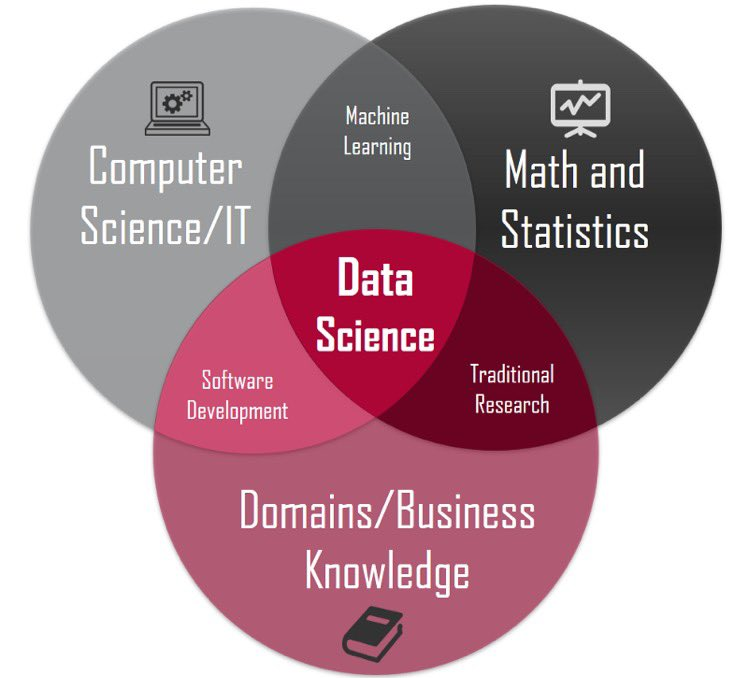

# 数据科学中的 R 语言 

## 课程简介

- 数据科学是综合了统计学、计算机科学和专业领域的交叉学科，具体内容就是用数据的方法研究科学，用科学的方法研究数据。
- R 是一种统计分析的编程语言，集统计分析与图形显示于一体。通过学习和掌握语言的语法，可以编制自己的函数来扩展现有的语言。
- 2019 年国际统计学年会将考普斯总统奖（统计学界的诺贝尔奖）颁给 R 语言宏包 tidyverse 的作者 Hadley Wickham，说明 R 语言得到了学术界的充分认可。
- 由于统计分析能力突出、作图功能强大、拓展与开发能力强等特点，在国际上，R 语言在自然科学和社会科学研究领域，得到了越来越广泛的应用。

本课程将以 R 语言作为数据科学学习之旅的新起点，讲解 R 语言入门基础、数据可视化、数据处理、探索性分析、统计建模、案例解析以及在代表性领域的应用，适用于研究生和博士生。

## 课程目标
训练数据思维、提升编程技能、培养创新能力

## 课程内容 

| 编号 	| 标题             	| 主要内容                                                                     	|
|:----:	|------------------	|------------------------------------------------------------------------------	|
|   0  	| Why R?           	| R是什么？R能干什么？为什么是R?                                               	|
|   1  	| 安装与环境配置   	| 了解数据科学流程，配置运行环境，安装R和Rstudio，以及如何安装所需要的宏包     	|
|   2  	| R语言基础        	| 基本运算、数据类型、数据结构、常用统计函数等，了解脚本、宏包以及如何获取帮助 	|
|   3  	| 可重复性文档     	| Rmarkdown语法，生成html格式报告、生成pdf格式报告、生成word格式报告           	|
|   4  	| 运算符及向量运算 	| 算术运算符，关系运算符，逻辑运算符等                                         	|
|   5  	| 函数             	| 基础函数、自定义函数，函数调用，使用宏包函数                                 	|
|   6  	| 子集选取         	| 向量、列表、矩阵、数据框                                                     	|
|   7  	| 读取数据         	| 项目管理，文件命名，读取外部文件                                             	|
|   8  	| 数据处理         	| dplyr数据处理，案例讲解                                                      	|
|   9  	| 数据处理进阶     	| 各种数据处理技巧                                                             	|
|  10  	| 数据可视化1      	| ggplot2基本语法、映射、设置、图片保存                                        	|
|  11  	| 数据可视化2      	| 几何图形                                                                     	|
|  12  	| 数据可视化3      	| 标度体系                                                                     	|
|  13  	| 数据可视化4      	| 主题风格                                                                     	|
|  14  	| 数据规整         	| 长表格、宽表格以及相互转化                                                   	|
|  15  	| 因子类型数据     	| 因子型变量及其在可视化中的应用                                               	|
|  16  	| 字符串处理       	| 正则表达式，文本信息提取                                                     	|
|  17  	| 基础统计分析     	| 基本描述统计，假设检验，方差分析，以及与线性回归的等价性                     	|
|  18  	| 线性回归         	| 一元回归、多元回归模型，重点是分析和解释模型输出、拟合与预测                 	|
|  19  	| 多层模型         	| 多层线性模型， pooling model, no-pooling model, partially pooled model       	|
|  20  	| 探索性数据分析1  	| 结合案例数据，综合运用数据处理、可视化探索技能                               	|
|  21  	| 探索性数据分析2  	| 结合具体案例，完成数据分析和建模，训练数据思维                               	|

## 关于考核
结合所在学科，找一篇与自己研究方向相关的文献，用课堂上学到的 R 统计编程技能，**重复**文献的数据分析和可视化过程.

## 参考书目
- [https://r4ds.had.co.nz/](https://r4ds.had.co.nz/)
- [https://bookdown.org/wangminjie/R4DS/](https://bookdown.org/wangminjie/R4DS/)

## 我会努力的
愿 R 语言成为你构建知识大厦的脚手架！
